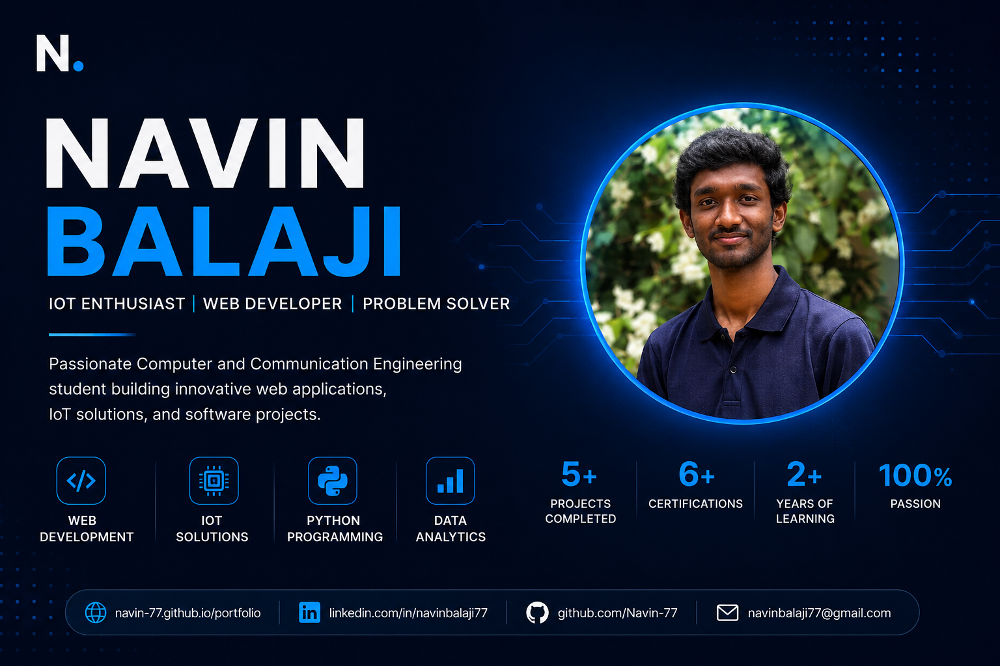

<p align="center">



</p>

<div align="center">

# 👋 Hi, I'm Navin Balaji

### Aspiring Software Developer | AI & IoT Enthusiast | Python Developer

<p align="center">

<a href="https://navin-77.github.io/portfolio/">

</a>

<a href="https://github.com/Navin-77">

</a>

<a href="https://www.linkedin.com/in/navin-balaji-568416367/">

</a>

<a href="assets/resume/NAVIN_RESUME.pdf">

</a>

</p>

</div>

---

# 🌐 Live Portfolio

👉 **https://navin-77.github.io/portfolio/**

---

# 📖 About

I am **Navin Balaji**, a B.Tech Computer and Communication Engineering student at **Amrita Vishwa Vidyapeetham, Chennai**.

I enjoy building software applications, AI-powered systems, IoT solutions, and full-stack web applications that solve real-world problems.

---

# ✨ Features

- Responsive Portfolio Website
- Dark / Light Theme
- Interactive Project Gallery
- Certificate Gallery
- Resume Download
- Contact Form
- SEO Optimized
- Open Graph Support
- GitHub Pages Deployment

---

# 🛠 Tech Stack

### Languages

- Python
- C
- HTML5
- CSS3
- JavaScript

### Tools

- Git
- GitHub
- VS Code
- Streamlit
- Firebase
- ESP8266
- EmailJS

---

# 🚀 Featured Projects

## 📈 Real-Time Stock Market Dashboard

A real-time stock dashboard built using Python and Streamlit.

**Technologies**

- Python
- Streamlit
- Plotly
- yFinance

---

## 😊 AI Sentiment Analyzer

An AI-powered sentiment analysis web application that predicts positive, negative, or neutral sentiment from user text.

**Technologies**

- Python
- Machine Learning
- Streamlit

---

# 📂 Project Structure

```text
portfolio
│
├── assets
├── css
├── images
├── js
├── index.html
├── robots.txt
├── sitemap.xml
└── README.md
```

---

# 📬 Contact

📧 Email

navinbalaji77@gmail.com

💼 LinkedIn

https://www.linkedin.com/in/navin-balaji-568416367/

🐙 GitHub

https://github.com/Navin-77

---

# ⭐ If you like this project

Give it a ⭐ on GitHub.